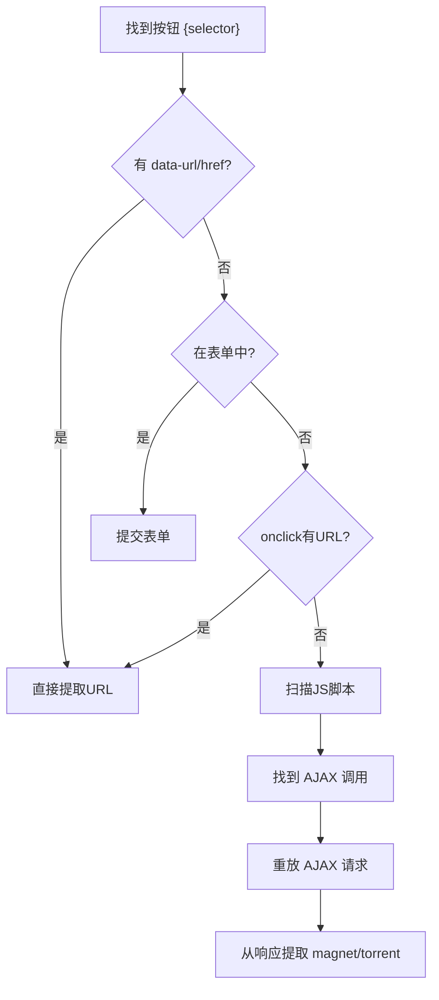

# SiteDownloadBridge YAML 配置指南

## 目录
1. [快速开始](#快速开始)
2. [配置结构总览](#配置结构总览)
3. [三大功能详解](#三大功能详解)
   - [indexer — 索引器注册](#1-indexer--索引器注册)
   - [bridge — 下载桥接](#2-bridge--下载桥接)
   - [trigger — 按钮触发](#3-trigger--按钮触发)
4. [完整示例](#完整示例)
5. [常见问题](#常见问题)

---

## 快速开始

### 仅需要下载桥接（站点已在 TorrentKitty 中）

```yaml
sites:
  - name: "FileMood"
    domains: ["filemood.com"]
    bridge:
      need_cookie: true
      need_proxy: true
      trigger:
        selector: "#download-btn"
```

### 需要完整的索引器 + 桥接（新站点）

```yaml
sites:
  - name: "MySite"
    domains: ["mysite.com"]
    indexer:
      domain: "mysite.com"
      # ... 索引器配置（见下文）
    bridge:
      need_cookie: true
      need_proxy: false
```

---

## 配置结构总览

```
sites:                          # 站点列表（数组）
  - name: "站点名称"             # 必填，用于日志显示
    domains:                    # 必填，站点域名列表
      - "example.com"
    
    indexer:                    # 可选，索引器配置
      domain: "example.com"     #   索引器域名
      public: false             #   是否公开站点
      search: {...}             #   搜索配置
      torrents: {...}           #   种子字段提取规则
    
    bridge:                     # 可选，下载桥接配置
      need_cookie: true         #   是否需要站点 Cookie
      need_proxy: true          #   是否使用代理(FlareSolverr)
      download_selector: ""     #   可选，CSS选择器精确定位下载链接
      download_attr: "href"     #   提取的属性名
      encoding: "utf-8"         #   页面编码
      url_regex: ""             #   可选，URL正则过滤
      
      trigger:                  #   可选，按钮触发配置
        selector: "#btn"        #     必填，按钮的CSS选择器
        mode: "auto"            #     可选，auto|attribute|form|script
        attribute: ""           #     可选，指定要读取的属性名
        form_selector: ""       #     可选，指定表单选择器
        script_url_regex: ""    #     可选，从JS中提取URL的正则
        script_data_field: ""   #     可选，AJAX data字段名
        ajax_method: ""         #     可选，GET|POST（自动检测）
```

---

## 三大功能详解

### 1. indexer — 索引器注册

为 MoviePilot 添加自定义站点的**搜索能力**，自动获取标题、大小、做种者、
下载者、下载链接等元数据。格式兼容官方索引器 JSON，但使用 YAML 无需 base64。

```yaml
indexer:
  domain: "p.example.com"       # 站点域名（取后两段）
  public: false                 # 是否公开站点
  encoding: "UTF-8"             # 页面编码
  search:                       # 搜索配置
    paths:
      - path: "/torrents.php?search={keyword}&search_area=0"
        method: "get"           # get 或 post
    params:                     # 可选，POST 参数
      search: "{keyword}"
  torrents:                     # 种子列表提取规则
    list:
      selector: "table.torrents > tbody > tr:has(td)"
    fields:                     # 字段提取（CSS选择器）
      title:                    # 标题
        selector: "td:nth-child(2) a[href*='details']"
      download:                 # 下载链接
        selector: "td:nth-child(3) a"
        attribute: "href"
      details:                  # 详情页链接
        selector: "td:nth-child(2) a"
        attribute: "href"
      size:                     # 文件大小
        selector: "td:nth-child(5)"
      seeders:                  # 做种者
        selector: "td:nth-child(6)"
      leechers:                 # 下载者
        selector: "td:nth-child(7)"
      date_added:               # 发布时间
        selector: "td:nth-child(4)"
      grabs:                    # 完成数
        selector: "td:nth-child(8)"
      downloadvolumefactor:     # 下载折扣
        case: {"*": 1}
      uploadvolumefactor:       # 上传倍率
        case: {"*": 1}
```

### 2. bridge — 下载桥接

处理**二次跳转**场景：搜索结果返回的是种子详情页（.html 页面），
而非直接下载链接（.torrent / magnet:）。

插件会自动抓取详情页，按以下优先级查找下载链接：

1. 如果配置了 `download_selector`，用 CSS 选择器精确提取
2. 否则**自动扫描**页面所有 `<a>` 标签，匹配：
   - `magnet:` 开头的磁力链接
   - 包含 `.torrent` 的 URL
   - 包含 `download`/`torrent`/`getfile` 关键字的 URL
3. 按优先级返回：`磁力链接 > .torrent 文件 > 其他候选`

```yaml
bridge:
  need_cookie: true             # 抓取时需要站点 Cookie
  need_proxy: true              # 使用 FlareSolverr 代理
  download_selector: ""         # 留空 = 自动扫描
  # 精确模式示例:
  # download_selector: "a.download-btn"
  # download_attr: "href"
  # url_regex: "\.torrent$"
```

### 3. trigger — 按钮触发

处理 **JavaScript 按钮点击**才能触发下载的场景（如 FileMood）。

插件无法运行 JavaScript，但会通过以下策略**模拟**点击：

| 策略 | 说明 | 示例 |
|------|------|------|
| `attribute` | 读取按钮的 data-url / data-href / href 等属性 | `<a data-url="magnet:?..."` |
| `onclick` | 解析 onclick 中的 URL | `onclick="location.href='/dl'"` |
| `form` | 提交按钮所在的 `<form>` | `<form action="dl.php">` |
| `script` | 扫描 `<script>` 标签中的 AJAX 调用并重放 | `$.post('link/index',...)` |

**配置示例：**

```yaml
bridge:
  need_cookie: true
  need_proxy: true
  trigger:
    selector: "#download-btn"   # 按钮的 CSS 选择器（必填）
    mode: "auto"                # 自动尝试所有策略（默认）
    # ---- 可选：精确指定策略 ----
    # attribute: "data-url"     # 直接读取指定属性
    # form_selector: "#dl-form" # 指定表单（默认自动查找）
    # script_url_regex: ""      # 自定义正则提取JS中的URL
    # script_data_field: "data" # AJAX data 字段名
    # ajax_method: "POST"       # AJAX 请求方法
```

**触发流程：**



---

## 完整示例

### 示例 1：FileMood（仅桥接 + 按钮触发）

```yaml
sites:
  - name: "FileMood"
    domains: ["filemood.com"]
    bridge:
      need_cookie: true
      need_proxy: true
      trigger:
        selector: "#download-btn"
```

### 示例 2：T-Baozi（索引器 + 桥接，无按钮触发）

```yaml
sites:
  - name: "T-Baozi"
    domains: ["p.t-baozi.cc"]
    indexer:
      domain: "p.t-baozi.cc"
      public: false
      search:
        paths:
          - path: "/torrents.php?search={keyword}&search_area=0"
      torrents:
        list:
          selector: "table.torrents > tbody > tr:not(.table2_title)"
        fields:
          title:
            selector: "td:nth-child(2) table.torrentname a b"
          download:
            selector: "td:nth-child(2) a[href^='download.php']"
            attribute: "href"
          size:
            selector: "td:nth-child(5)"
          seeders:
            selector: "td:nth-child(6)"
    bridge:
      need_cookie: true
      need_proxy: false
```

### 示例 3：带自定义 CSS 选择器的精确模式

```yaml
sites:
  - name: "ComplexSite"
    domains: ["complex.com"]
    bridge:
      need_cookie: true
      need_proxy: true
      download_selector: "a.btn-download.high-quality"
      download_attr: "href"
      url_regex: "2160p|4K"
```

### 示例 4：多个站点

```yaml
sites:
  - name: "SiteA"
    domains: ["a.com"]
    bridge:
      need_cookie: true
      need_proxy: false

  - name: "SiteB"
    domains: ["b.com"]
    bridge:
      need_cookie: false
      need_proxy: true
      trigger:
        selector: ".dl-trigger"

  - name: "SiteC"
    domains: ["c.com"]
    indexer:
      domain: "c.com"
      search:
        paths:
          - path: "/search?q={keyword}"
      torrents:
        list:
          selector: ".torrent-row"
        fields:
          title:
            selector: ".title"
          download:
            selector: ".dl-link"
            attribute: "href"
    bridge:
      need_cookie: true
      need_proxy: true
```

---

## 常见问题

### Q: 如何判断我的站点是否需要 `trigger`？
**A:** 搜索后在搜索结果页按 F12 查看元素。如果下载按钮是 `<a href="magnet:...">` 或 `<a href="xxx.torrent">`，不需要 trigger。如果按钮是 `<a id="download-btn">`（无 href）且下载由 JavaScript 触发，就需要 trigger。

### Q: `mode: "auto"` 会尝试哪些策略？
**A:** 按顺序：attribute → onclick → form → script。找到任意一个有效下载链接即停止。

### Q: 为什么我的 AJAX 触发还是失败了？
**A:** 可能原因：
1. AJAX endpoint 需要 CSRF token（暂时不支持）
2. 响应是二进制 torrent 数据而非 URL（可尝试设置 `download_selector` 配合）
3. 需要 Referer 头（插件会自动携带）

查看 MoviePilot 日志中的 `[SiteDownloadBridge]` 前缀信息排查。

### Q: 如何获取站点的 CSS 选择器？
**A:** 浏览器 F12 → 右键点击目标元素 → "Copy" → "Copy selector"
